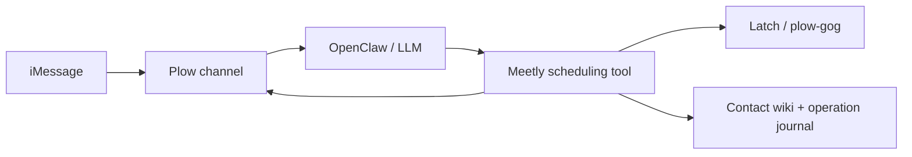

# Meetly

Meetly is a scheduling assistant you text through Plow. It researches the
conversation, holds three options, gets private owner approval for external
requests, and verifies the invitation before releasing the other holds.
The LLM interprets the request and writes every message, including reminders.
The owner can schedule in a private DM or an existing meeting group.
Meetly also discovers new direct iMessage requests on the Mac, with private
owner approval before any outreach. Email and prior messages are research;
unrelated tasks and other assistants' reports do not start meetings.

## Run privately on a local line

Use the **Build on Plow** path. Install
[plow-agents](https://github.com/plow-pbc/plow-agents), run Docker, and connect
[Plow Latch](https://howto.plow.co/latch) on the Mac with your messages and
calendar. Use the same Plow account for the CLI and Latch.

```sh
git clone https://github.com/EnzoTironi/meetly-openclaw-agent.git
cd meetly-openclaw-agent
plow-agents login
plow-agents deploy --local --line YOUR_LINE_UID
docker compose up -d
docker compose exec agent openclaw config set agents.defaults.heartbeat.every 0m
docker compose restart agent
```

Meetly's native service handles monitoring and model-written reminders.
The configuration above disables the separate OpenClaw heartbeat so its
framework alerts do not appear in the scheduling conversation.

Text that line. Meetly discovers your calendars and timezone, then asks
privately for preferences it cannot find. Save your video provider once:
Google Meet, a personal Zoom room, or a new Zoom link per meeting. New Zoom
links require a Zoom account connected to `plow-gog` through Latch.
Durations, travel buffers, working hours and reminder settings are reused.
An optional default meeting format fills gaps only when context does not
establish the format. Explicit owner exceptions apply to one request and
preserve the three-option workflow; they do not change global preferences.

The image has an empty `AGENT_ID`, so private tests do not register on the
Agent Index or report usage. Keep it empty in `plow-credentials`. Publishing
and registration are separate, explicit steps described by
[Plow's deployment guide](https://github.com/plow-pbc/plow-agents).
The image publication workflow runs only when manually dispatched.

The local dashboard binds to `127.0.0.1:3001`; set `HOST_PORT` to change it.
Use OpenClaw's native model settings and login. Your selected model and
credentials persist across image restarts; Meetly has no separate auth or
model router. Credentials belong in the ignored env file or native secret
store, never in the contact wiki.

```sh
docker compose logs -f agent
docker compose up --build -d     # rebuild after a code change
docker compose down              # stop while preserving the state volume
```

## Design

Plow owns delivery, phone lines, identities, the Mac bridge and model auth.
OpenClaw runs the conversation and the native Meetly plugin. There is one
skill, one scheduling tool and one periodic service. No custom entrypoint,
CLI-per-action, cron agent or transport runs alongside them.



The LLM handles language, dates, context, missing details and slot selection.
Guests use a tool-free model turn scoped to their meeting. The workflow
checks authority, current proposals, availability and provider receipts.
Every outgoing message is drafted by the configured model; its draft is
saved before sending so recovery cannot generate a different duplicate.
Guests receive answers in their meeting group, in the guest's language.
The latest verified guest message takes precedence over older language
preferences. Owner reports, questions and decisions go to the private owner
conversation, including when the owner requested the meeting in the group.
Booking confirmations and time updates include the verified video link
without a separate owner request.

The owner's preferences and video-link steps live at
`entities/owner/scheduling.md`. Each contact has one page at
`projects/founder-agent/pipeline/<slug>.md`, with exact live calendar IDs,
actual sent proposals, advisory next steps and a dated prose log.
These files live in OpenClaw's workspace, normally `/var/lib/plow/workspace`.
A small SQLite journal remembers unfinished writes and inbox sources; the
calendar and inbox determine what the wiki can claim.

The monitor runs every five minutes by default, configurable from 1–60.
It repairs interrupted operations, releases expired holds, checks replies
and calendar changes, and asks privately about blockers. It nudges the
owner once after four hours and the contact once after twenty-four hours,
only while the relevant action remains pending. A video meeting gets one
model-written join reminder with its current verified link, ten minutes
before it starts by default (`reminderMin: 0` disables it). Pausing stops
scheduled work. Discovery starts at the newest Mac receipt when first
enabled, then durably processes new messages without replaying history.

The Dockerfile pins the multi-architecture Plow base and applies an immutable,
checksummed bootstrap patch from
[Plow PR #47](https://github.com/plow-pbc/plow-openclaw-agent/pull/47).
That upstream change makes image-installed native plugins and shared channel
helpers available. Remove the patch when a published base includes it.

## Verify and review

Node 24.16+ is required. Local behavior tests need no credentials or network.

```sh
npm ci
npm run typecheck
npm test
```

[REVIEW.md](REVIEW.md) gives the reading order and evidence links.
[The acceptance guide](docs/scheduling-spec.md) maps the CEO spec and edge
cases to tests and describes the real iMessage journey.

Automatic intake covers new direct iMessage requests discovered on the Mac
and messages in served Plow groups. Mac discovery can prepare holds or ask
privately about missing details; only private owner approval can publish.
Group actions are limited to their verified contact, and external approval
always stays private. Email is research context, not an independent intake channel. A
provided iMessage email needs no Contacts card. Each meeting has one primary
chat contact and can invite additional attendees. A calendar invitation is
not proof that the attendee accepted it. Failed or unavailable providers
leave the action pending rather than inventing success.

For an existing installation, back up its state volume and finish or cancel
active legacy proposals before replacing the old workflow. Preserve its wiki
history and verify imported preferences against the owner's messages. The
legacy JSON ledger is not automatically migrated.
Start a fresh native owner session with `/new` after the cutover so obsolete
script instructions from the previous conversation do not carry forward.

MIT. See [LICENSE](LICENSE).
